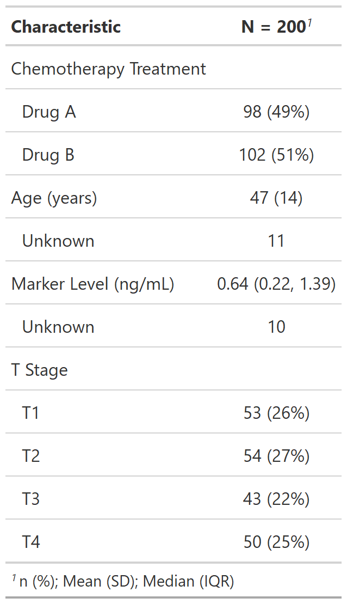

```{r setup, include=FALSE, eval=TRUE}
options(htmltools.dir.version = FALSE)
knitr::opts_chunk$set(
	eval = FALSE,
	fig.align = "center",
	message = FALSE,
	warning = FALSE
)
```

```{r xaringanExtra, include=FALSE, eval=TRUE}
xaringanExtra::use_tile_view()
htmltools::tagList(
  xaringanExtra::use_clipboard(
    button_text = "<i class=\"fa fa-clipboard\"></i>",
    success_text = "<i class=\"fa fa-check\" style=\"color: #90BE6D\"></i>"),
  rmarkdown::html_dependency_font_awesome()
  )
xaringanExtra::use_extra_styles(hover_code_line = TRUE,
                                mute_unhighlighted_code = FALSE)
xaringanExtra::use_broadcast()
```

```{r packages, include=FALSE, eval=TRUE}
library(tidyverse)
library(gtsummary)
library(emo)
```


class: slide-title


---

### What are the benefits?


--

```{r echo=FALSE, eval = TRUE, out.width="50%", fig.align='center'}

```

---

### What are the benefits?

.pull-left[
- Minimization of errors

- Time-saving

- Easy code sharing

- Flexibility

- Reproducibility

- Integration with `Rmarkdown`

- Several formats (e.g., Word, HTML)
]

.pull-right[

```{r echo=FALSE, eval = TRUE, out.width="100%", fig.align='center', fig.cap="Artwork by @allison_horst"}
knitr::include_graphics("https://raw.githubusercontent.com/allisonhorst/stats-illustrations/master/rstats-artwork/reproducibility_court.png")
```


]

---


.pull-left[

### Packages


- [`flextable`](https://davidgohel.github.io/flextable/)

- [`huxtable`](https://hughjonesd.github.io/huxtable/)

- [`kableExtra`](https://haozhu233.github.io/kableExtra/)

- [`DT`](https://rstudio.github.io/DT/)

- [`formattable`](https://renkun-ken.github.io/formattable/)

- [`gt`](https://gt.rstudio.com/)

- **[`gtsummary`](http://www.danieldsjoberg.com/gtsummary/)**

]

<br><br>


.pull-right[
```{r echo=FALSE, eval = TRUE, out.width="100%", fig.align='center'}
knitr::include_graphics("https://johnbraun.blog/assets/posts/creating-a-laravel-package-1/cover.jpeg")
```
]


---


## [`gtsummary`](http://www.danieldsjoberg.com/gtsummary/)

```{r}
install.packages("gtsummary")
library(gtsummary)
```

> An elegant and flexible way to create publication-ready analytical and summary tables using the R programming language.


**Functionalities**

- Automated tables with descriptive statistics, group comparisons, and regression models

- Automatic detection of the variable types (e.g., categorical, continuous)

- Integration with other packages (e.g., `gt`, `flextable`, `huxtable`)


---

### [`tbl_summary()`](http://www.danieldsjoberg.com/gtsummary/articles/tbl_summary.html)

`gtsummary`'s main function.

Performs descriptive statistics to continuous and categorical variables.


```{r}
trial %>%
  tbl_summary()
```


```{r}
tbl_summary(trial)
```

---

```{r eval=TRUE, echo=FALSE, out.width="25%"}

```


---

### Arguments

#### `label`

Specifies the names of the variables in the table.


Use: `label = variable_1 ~ "Variable 1"`

```{r}
trial %>%
  tbl_summary(label = trt ~ "Chemotherapy Treatment")
```


---

```{r eval=TRUE, echo=FALSE, out.width="35%"}

```


---


To edit the name of two or more variables, build a *list* with `list()` and follow the same pattern:


```{r}
var_names <- list(trt ~ "Chemotherapy Treatment",
                  age ~ "Age (years)",
                  marker ~ "Marker Level (ng/mL)",
                  stage ~ "T Stage")
trial %>%
  tbl_summary(label = var_names) # tbl_summary(label = list(...))
```

---

```{r eval=TRUE, echo=FALSE, out.width="30%"}
knitr::include_graphics("img/fig3.png")
```

.footnote[
Another way is using the [`labelled`](http://larmarange.github.io/labelled/) package.
]


---

#### `statistic`

Specifies the descriptive statistic shown in the table, distinguishing **continuous** and **categorical** variables.


Examples:

```{r}
dataset %>%
  tbl_summary(statistic = list(variable_1 ~ "{median}"))
```

--

```{r}
dataset %>%
  tbl_summary(statistic = c(variable_1, variable_2) ~ "{mean}")
```

--

```{r}
dataset %>%
  tbl_summary(statistic = list(c(variable_1, varible_2) ~ "{mean}",
                               variable_3 ~ "{n}"))
```


.footnote[
There are different ways to use the syntax. Please, check the [manual](http://www.danieldsjoberg.com/gtsummary/articles/tbl_summary.html#customize-output-1).
]

---

#### Continuous

*Default* is median (1st and 3rd quartiles):

```{r}
trial %>%
  tbl_summary(label = var_names)
```

---

```{r eval=TRUE, echo=FALSE, out.width="35%"}
knitr::include_graphics("img/fig4.png")
```


---


Changing to mean and standard deviation:

```{r}
trial %>%
  tbl_summary(label = var_names,
              statistic = list(age ~ "{mean} ({sd})"))
```

---


```{r eval=TRUE, echo=FALSE, out.width="35%"}

```

---

Using the `all_continuous()` function to modify all continuous variables:

```{r}
trial %>%
  tbl_summary(label = var_names,
              statistic = list(all_continuous() ~ "{mean} ({sd})"))
```


---

```{r eval=TRUE, echo=FALSE, out.width="30%"}

```

---


Descriptive statistics to continuous variables:

- `{median}`: median

- `{p##}`: percentile, where ## represents a number between 0 and 100 (e.g., `p25` means the 1st quartile)

- `{mean}`: mean

- `{sd}`: standard deviation


Other possible measures to this argument are available on `?tbl_summary`.

---


#### Categorical

*Default* is n e proportion:

```{r}
trial %>%
  tbl_summary(label = var_names)
```

---

```{r eval=TRUE, echo=FALSE, out.width="35%"}

```

---

Changing to n / N (sample) and proportion:

```{r}
trial %>%
  tbl_summary(label = var_names,
              statistic = list(trt ~ "{n} / {N} ({p}%)"))
```

---

```{r eval=TRUE, echo=FALSE, out.width="35%"}

```


---

Using the `all_categorical()` function to modify all categorical variables:

```{r}
trial %>%
  tbl_summary(label = var_names,
              statistic = list(all_categorical() ~ "{n} / {N} ({p}%)"))
```

---

```{r eval=TRUE, echo=FALSE, out.width="35%"}

```


---

Descriptive statistics to categorical variables:

- `{n}`: n by group/category

- `{N}`: sample n

- `{p}`: proportion

To insert the `%` symbol, put it **out** of the braces (`{p}%`).


---

Modifying continuous and categorical variables:


```{r}
trial %>%
  tbl_summary(label = var_names,
              statistic = list(all_continuous() ~ "{mean} ({sd})", 
                               all_categorical() ~ "{n} / {N} ({p}%)"))
```

---

```{r eval=TRUE, echo=FALSE, out.width="35%"}

```


---

#### `missing` and `missing_text`

`missing` tells whether to display a row with the number of missing observations. Allowed values are:

- `"ifany"` (*default*): only display *if any* `NA` values

- `"no"`: never display `NA` values

- `"always"`: includes NA count row for all variables.


`missing_text` changes the text label for the missing number row. *Default* is "Unknown".

```{r}
trial %>%
  tbl_summary(label = var_names,
              statistic = list(all_continuous() ~ "{mean} ({sd})",
                               all_categorical() ~ "{n} / {N} ({p}%)"),
              missing_text = "Missing")
```

---

```{r eval=TRUE, echo=FALSE, out.width="35%"}

```


---


#### `digits`

Specifies the number of decimal places for descriptive statistics.

Use: `digits = variable_1 ~ #`, where # sets the number of digits you want.


```{r}
trial %>%
  tbl_summary(label = var_names,
              statistic = list(all_continuous() ~ "{mean} ({sd})",
                               all_categorical() ~ "{n} / {N} ({p}%)"),
              missing_text = "Missing",
              digits = list(all_continuous() ~ 0,
                            all_categorical() ~ 0))
```


---

```{r eval=TRUE, echo=FALSE, out.width="35%"}

```


---

To determine the number of decimal plances for **each** descriptive measure (e.g., *n*, mean and SD):


```{r}
trial %>%
  tbl_summary(label = var_names,
              statistic = list(all_continuous() ~ "{mean} ({sd})",
                               all_categorical() ~ "{n} / {N} ({p}%)"),
              missing_text = "Missing",
              digits = list(all_continuous() ~ c(2, 2),
                            all_categorical() ~ c(0, 0, 1))) 
```

In `all_categorical() ~ c(0, 0, 1)`:

- `0` indicates **none** decimal to the *n* `{n}`;

- `0` indicates **none** decimal to the *sample n* `{N}`;

- `1` indicates **one** decimal to the *proportion* `{p}`.

`r emo::ji("question")` What will happen to the **mean** and **sd** decimal digits?


---

```{r eval=TRUE, echo=FALSE, out.width="35%"}

```

---


#### `by`

Receives **one** categorical variable (e.g., Treatment).

Computes the descriptive statistics for each **category** (e.g., Treatment A, Treatment B).

It's the first step for performing comparison/association tests.


```{r}
var_names <- list(age ~ "Age (years)",
                  marker ~ "Marker Level (ng/mL)",
                  stage ~ "T Stage")
trial %>%
  tbl_summary(label = var_names,
              statistic = list(all_continuous() ~ "{mean} ({sd})",
                               all_categorical() ~ "{n} / {N} ({p}%)"),
              missing_text = "Missing",
              digits = list(all_continuous() ~ c(2, 2),
                            all_categorical() ~ c(0, 0, 1)),
              by = trt)
```


---

```{r eval=TRUE, echo=FALSE, out.width="60%"}

```

---


### [`add_p()`](http://www.danieldsjoberg.com/gtsummary/reference/add_p.tbl_summary.html)

It's the `gtsummary`'s function to perform group comparisons and associations.

Adds a *p-value* column automatically.

It's used after the function `tbl_summary(..., by = cat_var)` (receives the `tbl_summary()` output).


```{r}
trial %>%
  tbl_summary(label = var_names,
              statistic = list(all_continuous() ~ "{mean} ({sd})",
                               all_categorical() ~ "{n} / {N} ({p}%)"),
              missing_text = "Missing",
              digits = list(all_continuous() ~ c(2, 2),
                            all_categorical() ~ c(0, 0, 1)),
              by = trt) %>%
  add_p()
```


---

```{r eval=TRUE, echo=FALSE, out.width="60%"}
knitr::include_graphics("img/fig15.png")
```

???
É usada depois da tbl_summary() porque o primeiro argumento do add_p() recebe a saída da tbl_summary() (objeto tbl_summary).


---

### Arguments

#### `test`

Defines the statistical test to compare/associate the groups.


```{r}
trial %>%
  tbl_summary(label = var_names,
              statistic = list(all_continuous() ~ "{mean} ({sd})",
                               all_categorical() ~ "{n} / {N} ({p}%)"),
              missing_text = "Missing",
              digits = list(all_continuous() ~ c(2, 2),
                            all_categorical() ~ c(0, 0, 1)),
              by = trt) %>%
  add_p(test = list(all_continuous() ~ "wilcox.test",
                    all_categorical() ~ "chisq.test.no.correct"))
```

---

```{r eval=TRUE, echo=FALSE, out.width="60%"}
knitr::include_graphics("img/fig16.png")
```

---

Available tests in the `add_p()` function:

- **Continuous**:

  - *t* test (`"t.test"`);

  - Mann-Whitney *U* test (a.k.a Wilcoxon rank-sum test) (`"wilcox.test"`) - _**default**_ when the *categorical variable* has 2 groups;
  
  - ANOVA *one-way* (`"aov"`);
  
  - Kruskal-Wallis test (`"kruskal.test"`) - _**default**_ when the *categorical variable* has 3 or more groups;
  
  - Paired *t* test (`"paired.t.test"`);
  
  - Wilcoxon signed-rank test (`"paired.wilcox.test"`).
  
  
---

- **Categorical**:

  - Chi-squared test of independence (`"chisq.test"`);

  - Chi-squared test with no correction  (`"chisq.test.no.correct"`) - _**default**_ when the amount of people in each cell is $\geq$ 5;
  
  - Fisher's test (`"fisher.test"`) - _**default**_ when the amount of people in, at least, one cell is < 5;
  
  - Mcnemar's test (`"mcnemar.test"`).
  
<br>

To check other available tests or to learn how to create a new test function, see the [manual](http://www.danieldsjoberg.com/gtsummary/reference/tests.html).


---


#### `pvalue_fun`


Function to round and format p-values. Default is [`gtsummary::style_pvalue()`](http://www.danieldsjoberg.com/gtsummary/reference/style_pvalue.html).

The function must have:

- **input**: a numeric vector (the numeric, exact p-value)

- **output**: a string that is the rounded/formatted p-value


```{r}
trial %>%
  tbl_summary(label = var_names,
              statistic = list(all_continuous() ~ "{mean} ({sd})",
                               all_categorical() ~ "{n} / {N} ({p}%)"),
              missing_text = "Missing",
              digits = list(all_continuous() ~ c(2, 2),
                            all_categorical() ~ c(0, 0, 1)),
              by = trt) %>%
  add_p(test = list(all_continuous() ~ "wilcox.test",
                    all_categorical() ~ "chisq.test.no.correct"),
        pvalue_fun = \(x) style_pvalue(x, digits = 3))
```

---

```{r eval=TRUE, echo=FALSE, out.width="60%"}

```


---


### `add_overall()`

Used after `tbl_summary(..., by = cat_var)`.

It creates a new column with *overall* descriptive statistics.


```{r}
trial %>%
  tbl_summary(label = var_names,
             statistic = list(all_continuous() ~ "{mean} ({sd})",
                              all_categorical() ~ "{n} / {N} ({p}%)"),
             missing_text = "Missing",
             digits = list(all_continuous() ~ c(2, 2),
                           all_categorical() ~ c(0, 0, 1)),
             by = trt) %>%
  add_p(test = list(all_continuous() ~ "wilcox.test",
                    all_categorical() ~ "chisq.test.no.correct"),
        pvalue_fun = \(x) style_pvalue(x, digits = 3)) %>%
  add_overall()
```


---

```{r eval=TRUE, echo=FALSE, out.width="70%"}

```


???
É usada depois da tbl_summary() porque o primeiro argumento do add_overall() recebe a saída do tbl_summary.


---

#### `col_label`

An argument to rename the column added by `add_overall()`.

*Default* is `"**Overall**, N = {N}"`.

```{r}
trial %>%
  tbl_summary(label = var_names,
              statistic = list(all_continuous() ~ "{mean} ({sd})",
                               all_categorical() ~ "{n} / {N} ({p}%)"),
              missing_text = "Missing",
              digits = list(all_continuous() ~ c(2, 2),
                            all_categorical() ~ c(0, 0, 1)),
              by = trt) %>%
  add_p(test = list(all_continuous() ~ "wilcox.test",
                    all_categorical() ~ "chisq.test.no.correct"),
        pvalue_fun = \(x) style_pvalue(x, digits = 3)) %>%
  add_overall(col_label = "**Sample**, N = {N}") 
```

---

```{r eval=TRUE, echo=FALSE, out.width="70%"}

```


---

### Extra

- `bold_labels()`: **Bold** the **names** of the variables.

- `italicize_labels()`: *Italicize* the *names* of the variables.

```{r}
trial %>%
  tbl_summary(label = var_names,
              statistic = list(all_continuous() ~ "{mean} ({sd})",
                               all_categorical() ~ "{n} / {N} ({p}%)"),
              missing_text = "Missing",
              digits = list(all_continuous() ~ c(2, 2),
                            all_categorical() ~ c(0, 0, 1)),
              by = trt) %>%
  add_p(test = list(all_continuous() ~ "wilcox.test",
                    all_categorical() ~ "chisq.test.no.correct"),
        pvalue_fun = \(x) style_pvalue(x, digits = 3)) %>%
  add_overall(col_label = "**Sample**, N = {N}") %>%
  bold_labels()
```

---

```{r eval=TRUE, echo=FALSE, out.width="70%"}

```

---

- `bold_levels()`: **Bold** the **categories** of the variables.

- `italicize_levels()`: *Italicize* the *categories* of the variables.

```{r}
trial %>%
  tbl_summary(label = var_names,
              statistic = list(all_continuous() ~ "{mean} ({sd})",
                               all_categorical() ~ "{n} / {N} ({p}%)"),
              missing_text = "Missing",
              digits = list(all_continuous() ~ c(2, 2),
                            all_categorical() ~ c(0, 0, 1)),
              by = trt) %>%
  add_p(test = list(all_continuous() ~ "wilcox.test",
                    all_categorical() ~ "chisq.test.no.correct"),
        pvalue_fun = \(x) style_pvalue(x, digits = 3)) %>%
  add_overall(col_label = "**Sample**, N = {N}") %>%
  bold_labels() %>%
  italicize_levels()
```

---

```{r eval=TRUE, echo=FALSE, out.width="70%"}

```

---

- `bold_p()`: **Bold** p-values according to a significance level (*default* is `t = 0.05`).

```{r}
trial %>%
  tbl_summary(label = var_names,
              statistic = list(all_continuous() ~ "{mean} ({sd})",
                               all_categorical() ~ "{n} / {N} ({p}%)"),
              missing_text = "Missing",
              digits = list(all_continuous() ~ c(2, 2),
                            all_categorical() ~ c(0, 0, 1)),
              by = trt) %>%
  add_p(test = list(all_continuous() ~ "wilcox.test",
                    all_categorical() ~ "chisq.test.no.correct"),
        pvalue_fun = \(x) style_pvalue(x, digits = 3)) %>%
  add_overall(col_label = "**Sample**, N = {N}") %>%
  bold_labels() %>%
  italicize_levels() %>%
  bold_p(t = 0.1)
```


---

```{r eval=TRUE, echo=FALSE, out.width="70%"}
knitr::include_graphics("img/fig22.png")
```

---


### How to save the table?

The `gtsummary` package prints the tables in HTML format.

We can save them in several formats (e.g., png, svg, pdf, Word).

We will focus on *Word* documents. [Click](http://www.danieldsjoberg.com/gtsummary/articles/rmarkdown.html) to learn how to save in other formats.

The `gtsummary` package cannot save the table in a *Word* document.

So, let's ask the [`flextable`](https://davidgohel.github.io/flextable/) package for help.

```{r}
install.packages("flextable")
library(flextable)
```

---

### A recipe for saving tables in *Word*

**1-** <span style="color: #180D5B; font-weight: 600">Save</span> the table in a vector:

```{r}
my_table <- trial %>%
                tbl_summary(label = var_names,
                            statistic = list(all_continuous() ~ "{mean} ({sd})",
                                             all_categorical() ~ "{n} / {N} ({p}%)"),
                            missing_text = "Missing",
                            digits = list(all_continuous() ~ c(2, 2),
                                          all_categorical() ~ c(0, 0, 1)),
                            by = trt) %>%
                add_p(test = list(all_continuous() ~ "wilcox.test",
                                  all_categorical() ~ "chisq.test.no.correct"),
                      pvalue_fun = \(x) style_pvalue(x, digits = 3)) %>%
                add_overall(col_label = "**Sample**, N = {N}") %>%
                bold_labels() %>%
                italicize_levels() %>%
                bold_p()
```


---

**2-** <span style="color: #180D5B; font-weight: 600">Convert</span> the table into a `flextable` object using the `gtsummary::as_flex_table()` function:

```{r}
my_table <- my_table %>%
  as_flex_table()
```

--

<br>

**3-** <span style="color: #180D5B; font-weight: 600">Save</span> the table to a *Word* document using the `flextable::save_as_docx()` function:

```{r}
save_as_docx(my_table, path = "table-1.docx")
```

<br>

A new *Word* document will be created with the table inside.

**P.S.:** Remember the `.docx`.

---

### Tips

Check the [package website](http://www.danieldsjoberg.com/gtsummary/index.html) to learn:

- Regression/survey design/time-to-event tables

- Other useful functions (e.g., `tbl_merge`, `add_stat`)
  
- Inline reporting (i.e., `inline_text()`)
  
Books:

- [R for Data Science](https://r4ds.had.co.nz) (Hadley Wickham & Garrett Grolemund)

- [Advanced R](https://adv-r.hadley.nz) (Hadley Wickham)


<br>

.footnote[
This presentation was built in `R/RStudio` with `xaringan`, `xaringanthemer`, and `xaringanExtra` packages.
]


---

class: slide-thanks

