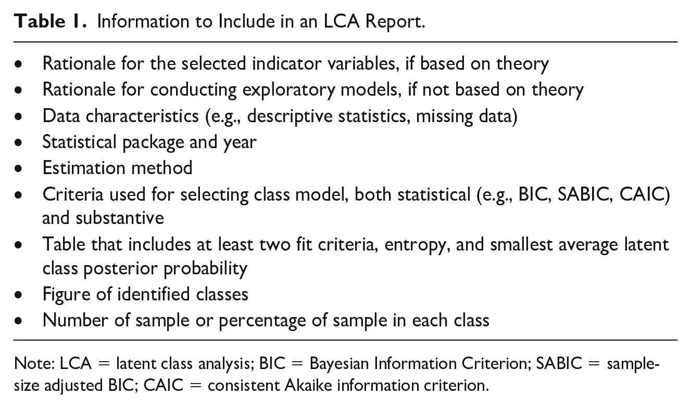

background-image: url("img/title.svg")
background-position: center
background-size: contain, 50% 50%, cover


  
```{r setup, include=FALSE, eval=TRUE}
options(htmltools.dir.version = FALSE)
knitr::opts_chunk$set(
  eval = TRUE,
  fig.align = "center",
  message = FALSE,
  warning = FALSE,
  echo = TRUE
)
```

```{r xaringanExtra, include=FALSE, eval=TRUE}
xaringanExtra::use_tile_view()
htmltools::tagList(
  xaringanExtra::use_clipboard(
    button_text = "<i class=\"fa fa-clipboard\"></i>",
    success_text = "<i class=\"fa fa-check\" style=\"color: #90BE6D\"></i>"),
  rmarkdown::html_dependency_font_awesome()
)
xaringanExtra::use_extra_styles(hover_code_line = TRUE,
                                mute_unhighlighted_code = FALSE)
xaringanExtra::use_broadcast()
xaringanExtra::use_freezeframe()
```

```{r packages, include=FALSE, eval=TRUE}
library(tidyverse)
library(gtsummary)
library(huxtable)
library(emo)
```

---

# (Finite) Mixture Models

> (Finite) Mixture Models are a family of statistical procedures for uncovering hidden groups.

<br>

`r emo::ji("target")` To provide a **probabilistic classification** of persons to latent classes based on a __statistical model__.

---

background-image: url("img/statistical.svg")
background-position: center
background-size: contain, 50% 50%, cover


---

background-image: url("img/prob.svg")
background-position: center
background-size: contain, 50% 50%, cover


---

background-image: url("img/lpa.svg")
background-position: center
background-size: contain, 50% 50%, cover


---

background-image: url("img/lca.svg")
background-position: center
background-size: contain, 50% 50%, cover


---


# Latent Class Analysis

> The main goal of LCA is to identify groups, called latent classes, based on responses to a set of observed indicators ([Nylung-Gibson & Choi, 2018](https://www.statmodel.com/download/LCAFAQ.pdf)).

- Applied to cross-sectional data.

- Uses responses to a chosen set of indicators to __identify groups of people__ that are __alike__ each other.

- Categorical (usually binary) indicators.

  - **Exploratory**: uncover hidden group based on data;
  
  - **Confirmatory**: test for the equivalence of latent class solutions.

---

#### Assumption

The assumption underlying LCA is that membership in unobserved classes can __cause or explain__ patterns of scores across indicators.

- Inside of a class, the correlations between the indicators become zero.

--

#### LCA researchers must:

- interpret classes theoretically;

- explain the implications of class membership for practice.

--

#### Validation

Determine if class assignments are related as expected to relevant outcomes.

---

## Cluster analysis *vs.* LCA


.pull-left[

<center><strong>Cluster analysis</strong></center>

- The cases with the most similar scores belong in the same __cluster__.

- Variables should be __continuous__ (means).

- Case membership in clusters is __determined__ in cluster analysis.

]


.pull-right[

<center><strong>LCA</strong></center>

- __Latent classes__ exist and explain patterns of observed scores across cases.

- Variables are __categorical__ (cross-tabulation).

- __Probabilities__ of class membership are obtained, not clear-cut assignments.

]

---

## Software

There are some softwares which can run LCA:

- __MPLUS__

- __Latent GOLD__

- __STATA__

- __SAS__

- __R__

--
`r emo::ji("thumbsup")`


---

## poLCA

[poLCA](https://cran.r-project.org/web/packages/poLCA/poLCA.pdf) is a package to perform Latent Class Analysis with polytomous variable.

It has a simple, friendly syntax and does almost everything we need by now.

```{r eval = FALSE}
install.packages("poLCA")
library(poLCA)
```


---

# Steps to perform LCA

Let's dive into a practical example!

The dataset `pd` comes from [Richter et al. (2013).](https://econtent.hogrefe.com/doi/full/10.1024/1010-0652/a000104)


```{r}
library(tidyverse)
library(knitr)
pd <- read.table("code-template/dataset_pd.txt", header = TRUE)[-9]
knitr::kable(head(pd, 3))
```


---

There are eight binary variables (no = 1; yes = 2) indicating teachers’ participation in professional development (PD) courses on several topics during the last five years:

.pull-left[

- Content knowledge (CK)

- Pedagogical content knowledge (PCK)

- Teaching and learning methods (TLM)

- Teaching heterogeneous students (THS)

]

.pull-right[

- Classroom management and discipline (CMD)

- Individualized learning support (ILS)

- Counseling students and parents (CSP)

- Knowledge of kids and youth (KKY)


]


---

## Sample size

To date, there are __no concrete guidelines__ for sample size for LCA models.

<br>

> Sample size of __300-1000__ is roughly the range in which most commonly used fit indices for mixture models can be expected to function adequately ([Nylung-Gibson & Choi, 2018.](https://www.statmodel.com/download/LCAFAQ.pdf))


---

Mininum sample size in LCA depends on several conditions:

- number of indicators included in the model;

- how well the indicators differentiate classes;

- how well-separated the classes are; 

- the relative sizes of the classes.

<br>

--

```{r}
nrow(pd)
```


---

## Exploratory Data Analysis

As in all the data analysis processes, it's important to start exploring the data.

__Frequency table__

.left-code[

```{r table-1, echo = TRUE, eval = FALSE}
library(gtsummary)
pd %>%
  purrr::map_df(factor, levels = c(1, 2), labels = c("No", "Yes")) %>%
tbl_summary()
```

]

.right-code[

```{r ref.label="table-1", echo = FALSE}

```

]

---

__Bar plot__

```{r fig.dim=c(8, 6)}
freq <- apply(X = pd, MARGIN = 2, FUN = table)
barplot(freq, beside = TRUE, legend = c("No", "Yes"),
main = "Participation in PD activities")
```


---

__Tetrachoric correlation__

Suitable correlation coefficient for binary/dichotomous variables.

<br>

> It makes only sense to apply LPA/LCA if the set of indicators is inter-correlated ([Bauer, 2021.](https://psyarxiv.com/97uab/))


---

```{r fig.dim = c(10, 6), fig.retina=2}
library(correlation)
corr <- correlation(pd, method = "auto", include_factors = TRUE) %>%
  summary(redundant = FALSE) %>% visualisation_recipe(show_data = "tile")
plot(corr) + theme_minimal() + theme(panel.grid = element_blank())
```


---

## Model specification

> Researchers need to make a __theory-based selection of observed indicators__ ([Bauer, 2021.](https://psyarxiv.com/97uab/))

> Although researchers can use LCA as an exploratory statistical approach, __theory should guide__ the choice of indicator variables ([Weller et al., 2020.](https://journals.sagepub.com/doi/full/10.1177/0095798420930932))

> Item choice in an LCA should be motivated by __well-defined research questions__ ([Nylung-Gibson & Choi, 2018.](https://www.statmodel.com/download/LCAFAQ.pdf))


---

### Specifying the model in the poLCA package

We need to select the indicators and create a formula with them:

```{r}
my_formula <- cbind(CK, PCK, TLM, THS, CMD, ILS, CSP, KKY) ~ 1
```

The `~ 1` indicates we __don't__ want to estimate a model with covariates.

This formula will be used soon, as an argument in the function `poLCA()`.

---

## Class enumeration

In this step, we need to decide on the number of classes of our model.

The goal is to yield a solution that balances __model parsimony__ and __fit__, and that delivers substantively __interpretable classes__.

--

**The standard procedure**

1. Estimate a one-class model.

2. Estimate models with one additional class at a time.

3. Compare the models based on statistical and substantive criteria.

4. Continue to run models with one additional class until the best model is identified.


---

#### \#1

```{r eval = FALSE}
set.seed(42)

lca1 <- poLCA(formula = my_formula, data = pd, nclass = 1, maxiter = 5000, nrep = 100)
lca2 <- poLCA(formula = my_formula, data = pd, nclass = 2, maxiter = 5000, nrep = 100)
lca3 <- poLCA(formula = my_formula, data = pd, nclass = 3, maxiter = 5000, nrep = 100)
lca4 <- poLCA(formula = my_formula, data = pd, nclass = 4, maxiter = 5000, nrep = 100)
lca5 <- poLCA(formula = my_formula, data = pd, nclass = 5, maxiter = 5000, nrep = 100)
lca6 <- poLCA(formula = my_formula, data = pd, nclass = 6, maxiter = 5000, nrep = 100)
```

---

#### \#2

```{r eval = FALSE}
set.seed(42)
n_class <- 6
lca_models <- list()
for (i in seq_len(n_class)) {
  lca_models[[i]] <- poLCA::poLCA(formula = my_formula,
                                  data = pd,
                                  nclass = i,
                                  maxiter = 5000,
                                  nrep = 100)
}
```


```{r include=FALSE}
load(file = "code-template/lca_models.RData")
```


---


### Statistical criteria (fit indices)

Statistical criteria should always be evaluated in conjunction with interpretability.

There is no consensus about the __best criteria__ for comparing latent class solutions.

Multiple fit statistics should be used (or at least reported).

---

### Log-likelihood

Maximum value of the log-likelihood. It's used to calculate other fit indices.

```{r}
llik <- map_dbl(lca_models, function(x) x$llik)
```

--

### Bayesian Information Criteria (BIC)

The most reliable information criteria to indicate model fit [Nylund et al., 2007.](https://www.tandfonline.com/doi/abs/10.1080/10705510701575396?journalCode=hsem20)

Lower BIC (and other information criteria indices) indicates better fit.

```{r}
# Computing BIC
bic <- map_dbl(lca_models, function(x) x$bic)
```


---

### Akaike Information Criteria (AIC)

Not too realiable, but some articles presented it.

```{r}
aic <- map_dbl(lca_models, function(x) x$aic)
```


--

### Sample-size adjusted BIC (SABIC)

```{r}
n <- lca_models[[1]]$Nobs
npar <- map_dbl(lca_models, function(x) x$npar)
sabic <- (-2 * llik) + npar * log((n + 2) / 24)
```


---

### Consistent Akaike Information Criterion (CAIC)

```{r}
caic <- (-2 * llik) + npar * (log(n) + 1)
```

--

### Approximate Weight of Evidence Criterion (AWE)

Very closed to CAIC.

```{r}
awe <- (-2 * llik) + npar * (log(n) + 1.5)
```

---

We can create an elbow plot to display the information criteria indices.

It can be particularly useful to inspect for an “elbow” of point of “diminishing returns” in model fit (e.g., small decreases in the IC for each additional latent class).

```{r fig.dim=c(10, 5), fig.retina=2}
source("code-template/lca-functions.R")
elbow_plot(lca_models = lca_models)
```


---

### Bayes Factor

Provides a pairwise comparison of fit between two class models (k *vs.* k + 1).

Represents the ratio of the probability that each model being compared is true.

- 1 < BF < 3 suggests __weak__ support for the model with less classes.

- 3 < BF < 10 suggests __moderate__ support

- BF > 10 suggests __strong__ support.

```{r}
bf <- c()
        for (i in 1:length(lca_models)) {
                if (i + 1 <= length(lca_models)) {
                        a <- -0.05 * bic[i]
                        b <- -0.05 * bic[i + 1]
                        bf[i] <- gtsummary::style_sigfig(exp(a - b), digits = 3)
                } else {bf[i] <- NA}
        }
```


---

### Likelihood ratio tests

Vuong-Lo-Mendell-Rubin adjusted likelihood ratio test and bootstrapped likelihood ratio test (BLRT). Both are not implemented in R for poLCA objects.

---

## Classification diagnostics

Information about how well the classes are differentiated.


--

### Entropy

It indicates how accurately the model defines classes (it's not for selecting the final class solution).

Entropy values should be above, at least, 0.6.

```{r}
entropy <- function(x) {
                numerator <- -sum(x$posterior * log(x$posterior), na.rm = TRUE)
                denominator <- x$N * log(ncol(x$posterior))
                1 - (numerator / denominator)
        }
        ent <- map_dbl(lca_models, entropy)
```


---


### Gathering all the information in one table

```{r}
lca_table <- tbl_lca(lca_models)
lca_table <- set_font_size(lca_table, value = 8); lca_table
```

Based on the fit indices, let's investigate more the 5-class solution.

---

### Average latent class posterior probability (AvePP)

How well a given model classifies individuals into their most likely class.

This results in a matrix:

- __Diagonal__: e.g., the class 1 average probability for the people who were assigned to the class 1.

- __Off-diagonal__: e.g., the class 2 average probability for the people who were assined to the class 1.

Higher diagonal values (above 0.80; well-separated classes) and closer-to-0 off-diagonal values are desirable.


---

```{r}
tbl_avepp(lca_models, n_class = 5)
```


---


## Profile plot (item probability plot)

Given that the person belongs to class k, what is the likelihood of endorsing the item/indicator (for binary variables) or the category of the item (for polytomous variables)?

It gives the idea of who is belonging to each class.

---

```{r fig.dim = c(12, 6), fig.retina = 2}
my_model <- lca_models[[5]]
profile_plot(lca_model = my_model)
```


---

Based on the results, we can labeled the classes and examine the qualitative differences among the classes.

```{r}
lca_class <- data.frame(class = c("1: High on activities focusing general pedagogical topics",
                                    "2: High on activities focusing teaching methods",
                                    "3: High on all activities",
                                    "4: Low on all activities",
                                    "5: High on activities focusing (pedagogical) content knowledge and teaching methods"),
                        size = gtsummary::style_percent(my_model$P, digits = 2))
```

---

```{r}
knitr::kable(lca_class, col.names = c("Class", "Class size (%)"))
```


---

## Summary: what should you report?

```{r echo = FALSE, out.width="70%"}

```


---


## Creating a column with the modal assignment

LCA creates classes based on probabilities.

We can use these classes in subsequent analysis (e.g., regression models, networks).

Let's create a column in our dataset with this classification. The information we need is in `predclass`.

---

```{r}
pd$lca_class <- my_model$predclass
head(pd, 5)
```


---

# References & lectures

There is much more contents about LCA. Here are some references.

Papers:

- [A primer to latent profile and latent class analysis](https://psyarxiv.com/97uab/)

- [Latent Class Analysis: A Guide to Best Practice](https://journals.sagepub.com/doi/full/10.1177/0095798420930932)

- [Ten Frequently Asked Questions about Latent Class Analysis](https://www.statmodel.com/download/LCAFAQ.pdf)

- [Deciding on the Number of Classes in Latent Class Analysis and Growth Mixture Modeling: A Monte Carlo Simulation Study](https://www.tandfonline.com/doi/abs/10.1080/10705510701575396?journalCode=hsem20)

---

# References & lectures

Lectures:

- [Latent Class Analysis | Michael Toland](https://www.youtube.com/watch?v=Z-xmVCC0Y-8&list=PLKEQx6noA4Xqjmvryig2gjYpNWOvvjmiH)

- [Introduction to latent class / profile analysis | CenterStat](https://www.youtube.com/watch?v=NlZFm_EI8OM)

- [Estatística Psicobio II - SEM VII - LCA - Latent Class Analysis | Cientística & Podcast Naruhodo](https://www.youtube.com/watch?v=uLliIgUXpp0) `r emo::ji("Brazil")`


---

background-image: url("img/thanks.svg")
background-position: center
background-size: contain, 50% 50%, cover


