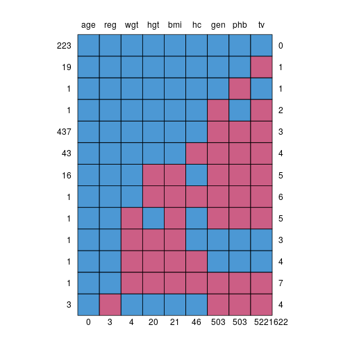
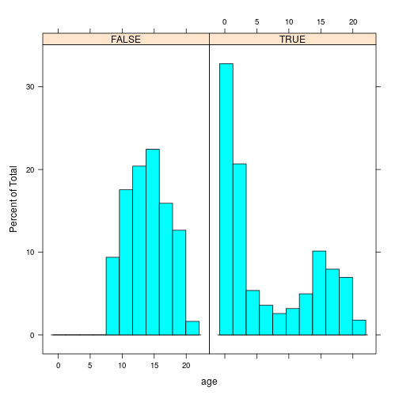
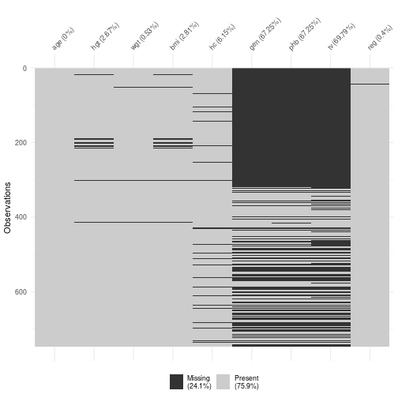
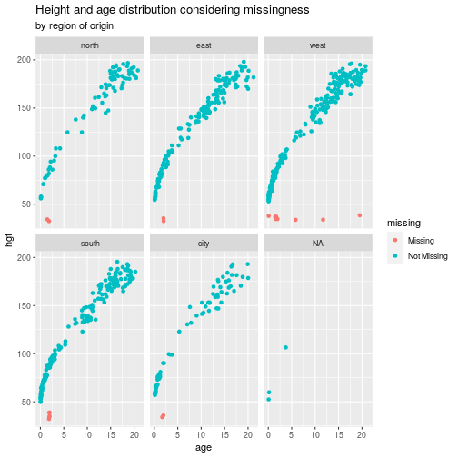
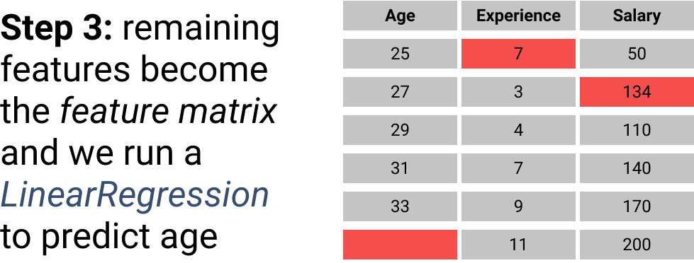
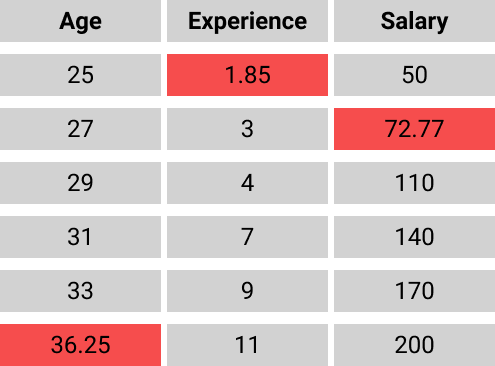
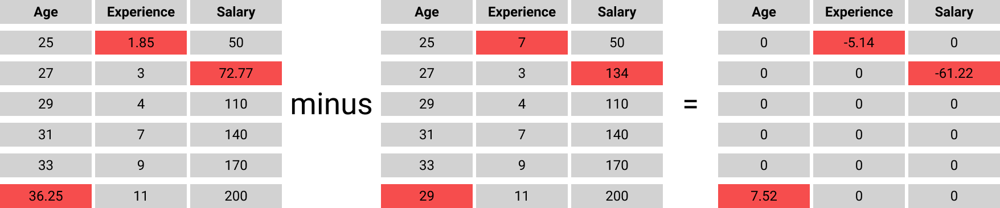

background-image: url("./fig/capa.svg")
background-position: center
background-size: contain, 50% 50%, cover

---

## Expectations...

--

.pull-left[

```{r, echo = FALSE}

```
]


--

.pull-right[
```{r, echo = FALSE}

```

]

---

## Missing

--

>"Missingness hides a meaningful value for analysis." - Rod Little

--

**Examples** - In a longitudinal study of blood pressure medications:

--

- Missing data from missed clinical visit ✅;
- no data because the patient died ❌;

---


## Types of missing data

**Scenario**: survey of mental health conditions at a company.

--

.pull-left[

#### Missing completely at random (MCAR)

Missingness does not depend on any other data;

**e.g**. the survey was missing the final 5 questions due to some error in printing;

We could say the complete data is just a subsample of the total possible data.

]

--

.pull-right[
#### Missing at random (MAR)

Missingess depends on unseen factors;

**e.g**. participants feel that the questions/possible answers are not able to express their feelings;

Complete case analysis would only represent participants that were "reached".

]

---

## Types of missing data

#### Missing not at random (MNAR)

**e.g**. men are less likely to answer questions about depression and that is *dependent* on their level of depression.

--

Complete case analysis would reveal a biased interpretation that **men have lower rates of severe depression**.


---

class: inverse, middle, center

# How to handle missing data

---

### What we usually do: complete case analysis

--

Discard rows(patients) that are missing for any variable;

--

- It is easy to implement ✅

--

- At the same time, it leads to biased estimates and reduction in power ❌;


--

Generally speaking, we blind ourselves to problems.

- In cases when missingness is around 5%, complete case analysis is acceptable;


---

## Alternatives

**Single imputation** such as mean imputation are an *improvement* but do not account for the uncertainty in the imputations;

- analysis proceeds as if the imputed values were known.

--

**Maximum likelihood** methods might be viable but are *primairly available* only for certain types of models

---

### Best approach: avoid missing data!

Regardless of the method you take, you are making **assumptions**!

--

If you can, try to **avoid or limit** missing data:
- Limit respondent burden in questionnaires;
- Collect information that helps to predict missingness;
- Follow up a subsample of nonrespondents.

---

```{r, warning=FALSE, message=FALSE, echo=FALSE}
library(mice); library(lattice); library(gtsummary); library(dplyr); library(naniar); library(ggplot2)
set.seed(123)
```


### Inspecting missing patterns

--

.pull-left[
```{r, eval=FALSE}
md.pattern(boys)
```

```{r, echo=FALSE, fig.align="center", out.height="450px"}

```
]

--

.pull-right[

```{r, eval=FALSE}
histogram(~age|is.na(boys$gen), data=boys)
```

```{r, echo=FALSE,out.height="420px"}

```

]

---

### Inspecting missing patterns

.pull-left[
```{r, eval=FALSE}
vis_miss(boys)
```

```{r, echo=FALSE, figt.height="320px"}

```

]

--

.pull-right[

```{r, eval=FALSE}
ggplot(boys, aes(x=age, y=hgt)) + geom_miss_point() + facet_wrap(~reg)
```


```{r, echo=FALSE, figt.height="270px"}

```


]

---

```{r, echo=FALSE}
boys1 <-  boys %>% 
  mutate(age_class=case_when(age <=5 ~ "5 or lower",
                             age > 5 & age <=11 ~ "Between 6 and 11",
                             age > 11 & age <= 17 ~ "Between 12 and 17",
                             age > 17 & age <= 29 ~ "Between 18 and 29",
                             age > 29 & age <= 49 ~ "Between 30 and 49",
                             age > 49 & age <= 64 ~ "Between 50 and 64",
                             age > 64 ~ "65 or more"))
boys1$age_class <- factor(boys1$age_class,
                          levels=c("5 or lower",
                                   "Between 6 and 11",
                                   "Between 12 and 17",
                                   "Between 18 and 29",
                                   "Between 30 and 49",
                                   "Between 50 and 64",
                                   "65 or more"))

```

### Inspecting missing patterns

```{r}
gg_miss_fct(boys1, age_class)
```

---

class: inverse, middle, center

# Imputation with `mice`

.footnote[
See [Codes](https://github.com/gemini-duke/toolbox/tree/main/missingness_analysis), [Video](https://drive.google.com/file/d/1DHqaUngAENOR29W3Wc4AIdEsJ9JzF8Qy/view?usp=sharing) and [SOP-TBD]() and [miceVignettes](https://www.gerkovink.com/miceVignettes/) for materials on this section
]

---

## The `mice` package  

Designed for flexible imputation of incomplete data. 

--


Sample data set
```{r, echo=FALSE, fig.alig="left"}
knitr::kable(head(nhanes), format = 'html',align='l')
```

---

class: inverse, middle, center

## Imputation methods

---

### Imputing with the mean

```{r, message=FALSE, warning=FALSE}
imp <- mice(nhanes, method='mean', m=1, maxit=1, print=FALSE)
```

```{r, echo=FALSE}
knitr::kable(head(complete(imp)), format = 'html')
```

---

### Imputing with the mean

Checking the model

--

```{r, echo=FALSE, fig.align="bottom"}
og.model <- lm(age~bmi, data=nhanes) %>% tbl_regression()
imp.model <- lm(age~bmi, data=complete(imp)) %>% tbl_regression()

merged.model <- tbl_merge(list(og.model, imp.model), tab_spanner = c("Og. data", "Mean-imputed")) 
merged.model %>% as_gt() %>% gt::tab_header(gt::md("**Age~BMI model**"))

```

--

No actual difference, as bmi follows a *normal-like* distribution

---

### Imputing with the mean

Checking the distribution


```{r, echo=FALSE, out.height="400px"}
stripplot(imp, chl~.imp, pch=20, cex=2)
```

---


### Regression imputation

```{r,echo=TRUE}
imp <- mice(nhanes, method="norm.predict", m=1, maxit=1, print=FALSE)
```

```{r, echo=FALSE}
knitr::kable(head(complete(imp)), format = 'html')
```

---

### Regression imputation.

Now we see some difference, which actually makes p < 0.05
```{r, echo=FALSE}
imp.model <- lm(age~bmi, data=complete(imp)) %>% tbl_regression() %>% bold_p()

merged.model <- tbl_merge(list(og.model, imp.model), tab_spanner = c("Og. data", "Regression-imputed")) 
merged.model  %>%  as_gt() %>% gt::tab_header(gt::md("**Age~BMI model**"))
```

---

### Regression imputation

Checking the distribution

```{r, echo=FALSE, out.height="400px"}
stripplot(imp, chl~.imp, pch=20, cex=2)
```


---
### Multiple imputation

The standard method used in mice is *predictive mean matching*

Multiple imputation by chained equations or mice.
---


Sample data

```{r, echo=FALSE, fig.align="center"}

```


---


```{r, echo=FALSE, fig.align="center"}

```

---

```{r, echo=FALSE, fig.align="center"}

```

---

```{r, echo=FALSE, fig.align="center"}

```


---

```{r, echo=FALSE, fig.align="center"}

```

---

```{r, echo=FALSE, fig.align="center"}

```

---

```{r, echo=FALSE, fig.align="center"}

```

---

```{r, echo=FALSE, fig.align="center"}

```


---

### Multiple imputation

--

The standard mice algorithm runs for 5 iterations and generates 5 imputations each.
```{r}
imp <- mice(nhanes, print=FALSE)
```

Checking the attributes of the `imp` object, we can access many different aspects of the process.
```{r}
attributes(imp)
```


---

### Multiple imputation

The original data is store as `imp$data` and the imputations within `imp$imp`;

We can return the imputed data set either in long or broad formats:
```{r}
c.long <- complete(imp, "long")
```

```{r, echo=FALSE}
knitr::kable(sample_n(c.long, 5), format = 'html')
```

---

### Which variables should be used for imputation?

`mice` allows you to explicitily determine which variables are going to be used for imputing others;

--

This is done through the predictor matrix
```{r}
pred <- imp$pred
```

```{r, echo=FALSE}
knitr::kable(pred, format = 'html')
```

---

### Which variables should be used for imputation?

Let's say you want to remove `hyp` from the set of predictors, but want it to be predicted by other variables
```{r}
pred[, "hyp"] <- 0
```

```{r, echo=FALSE}
knitr::kable(pred, format = 'html')
```
Now you can use your new matrix in the imputation process
```{r}
imp <- mice(nhanes, pred=pred, print=FALSE)
```

---

### Using cutoffs for selecting predictors

--

Let's say you want to  select variables that have at least 0.3 pearson correlation as predictors

```{r}
ini <- mice(nhanes, pred=quickpred(nhanes, mincor=.3), print=F)
```

```{r, echo=FALSE}
knitr::kable(pred, format = 'html')
```

--

For large matrices, you can export the data to excel and edit by hand.

---

## Method of imputation


```{r}
imp$method
```

--

In reality there are many more options

---

## Methods

```{r}
methods(mice)
```

---

```{r, echo=FALSE}
ini <- mice(nhanes2, print=F, maxit=0)
meth <- ini$meth
```

### Changing the methods of imputation

```{r}
meth["bmi"] <- "norm"
```

```{r}
imp <- mice(nhanes2, meth=meth, print=F)
```

```{r,echo=FALSE}
plot(imp)
```

---

## Convergence 

```{r}
imp40 <- mice.mids(imp, maxit=35, print=F)
plot(imp40)
```

---

## Diagnostics

.pull-left[

We expect that imputed data resembles possible observations;

Here we see that the red dots (imputed) mimic  the distribution of blue (og.) data;

Finally, we note how the gaps and range of the data are mantained;

]

.pull-right[
```{r, fig.align="center", fig.height = 5, fig.width=5}
stripplot(imp, chl~.imp, pch=20, cex=2)
```
]


---

## Diagnostics 

.pull-left[
bmi was imputed by Bayesian linear regression, so we do not have the same range.

```{r, fig.align="center", fig.height = 6, fig.width=9, eval=FALSE}
stripplot(imp, bmi~.imp, pch=20, cex=2)
```
]

.pull-right[
```{r, fig.align="center", fig.height = 6, fig.width=9, echo=FALSE}
stripplot(imp, bmi~.imp, pch=20, cex=2)
```
]

---

## Pooling

```{r}
fit <- with(imp, lm(bmi ~ chl))
pool.fit <- pool(fit)
summary(pool.fit)
```

```{r, warning=FALSE, echo=FALSE, message=FALSE}
imp_reg <- tbl_regression(fit)

og_reg <- lm(bmi~chl,nhanes2) %>% tbl_regression() 

tbl_merge(tbls=list(og_reg, imp_reg),tab_spanner = c("Og.data", "Imp.data"))
```

---

## References

- [Multiple imputation by chained equations: what is it and how does it work?](https://onlinelibrary.wiley.com/doi/epdf/10.1002/mpr.329);

- [R-miss-tastic: a unified platform for missing values methods and workflows](https://rmisstastic.netlify.app/posts/intro/)

- [Smart handling of missing data in R](https://towardsdatascience.com/smart-handling-of-missing-data-in-r-6425f8a559f2)

- [Statistical modeling and missing data - Rod Little](https://www.youtube.com/watch?v=SwgrdvE2gp4&ab_channel=InstituteforAdvancedStudy)

