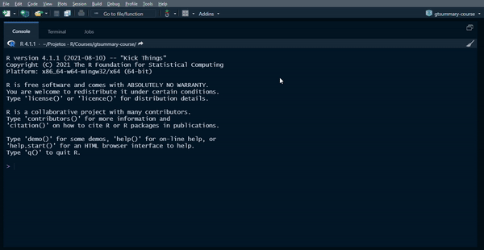
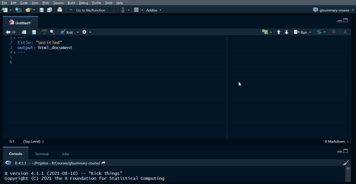
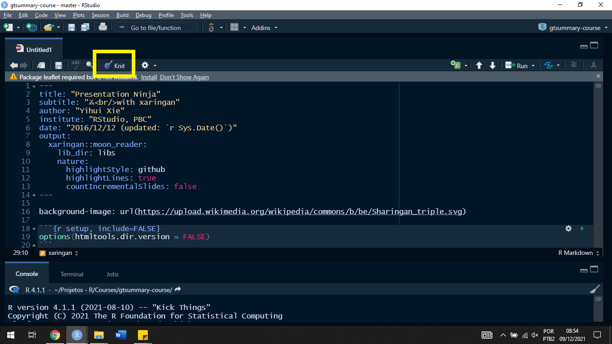
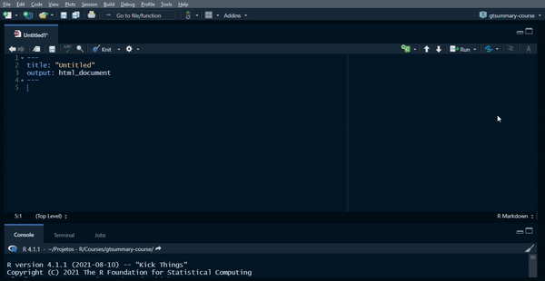
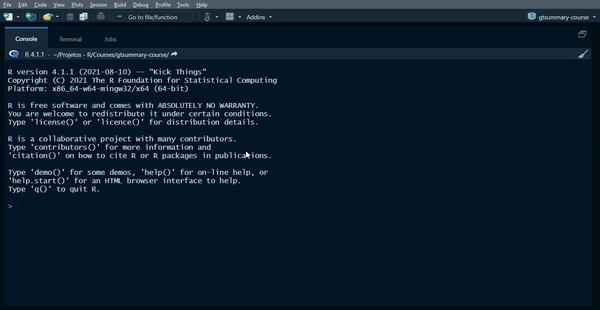

background-image: url("img/title-slide.png")
background-position: center
background-size: contain, 50% 50%, cover

  
```{r setup, include=FALSE, eval=TRUE}
options(htmltools.dir.version = FALSE)
knitr::opts_chunk$set(
  eval = TRUE,
  fig.align = "center",
  message = FALSE,
  warning = FALSE,
  echo = FALSE
)
```

```{r xaringanExtra, include=FALSE, eval=TRUE}
xaringanExtra::use_tile_view()
htmltools::tagList(
  xaringanExtra::use_clipboard(
    button_text = "<i class=\"fa fa-clipboard\"></i>",
    success_text = "<i class=\"fa fa-check\" style=\"color: #90BE6D\"></i>"),
  rmarkdown::html_dependency_font_awesome()
)
xaringanExtra::use_extra_styles(hover_code_line = TRUE,
                                mute_unhighlighted_code = FALSE)
xaringanExtra::use_broadcast()
xaringanExtra::use_freezeframe()
```

```{r packages, include=FALSE, eval=TRUE}
library(tidyverse)
library(gtsummary)
library(emo)
```


---


## Agenda

.pull-left[

```{r echo=FALSE, eval = TRUE, out.width="80%", fig.align='center'}
knitr::include_graphics("https://bookdown.org/yihui/rmarkdown/images/hex-rmarkdown.png")
```

]

.pull-right[

```{r echo=FALSE, eval = TRUE, out.width="80%", fig.align='center'}
knitr::include_graphics("https://user-images.githubusercontent.com/163582/45438104-ea200600-b67b-11e8-80fa-d9f2a99a03b0.png")
```

]


---


```{r echo=FALSE, eval = TRUE, out.width="70%", fig.align='center'}
knitr::include_graphics("https://beatrizmilz.github.io/slidesR/rmarkdown/img/rmarkdown_wizards.png")
```

> R Markdown is a powerful tool for combining analysis and reporting into the same document ([XIE et al., 2021](https://bookdown.org/yihui/rmarkdown-cookbook/)).


---

## What can we do with R Markdown?

```{r echo=FALSE, eval = TRUE, out.width="40%", fig.align='center'}
knitr::include_graphics("https://beatrizmilz.github.io/aMostra-IME-2019-Xaringan/img/markdown.png")
```

.footnote[
I really recommend you to take a look at the [R Markdown book](https://bookdown.org/yihui/rmarkdown/) and the [R Markdown gallery](https://rmarkdown.rstudio.com/gallery.html) to see all the possibilities.
]


---

## Open a R Markdown file

In your RStudio, `File` → `New File` → `R Markdown`.

After selecting the output format (HTML, PDF, etc), a document will be created.


---

```{r}

```


---


### R Markdown structure

In R Markdown files, we have two main structures:

- the YAML: delimited by `---` in the beginning of the document. Metadata responsible for important settings of the document (output format, title, output details, etc).

- the body: all the information below the YAML.

---

## Markdown syntax


.pull-left[

#### How we write

Plain text

End a line with two spaces (2x .keyboard[Return]) to start a new paragraph.

\*italics\* or \_italics\_

\*\*bold\*\* or \_\_bold\_\_

\~\~strikethrough\~\~


]

.pull-right[

#### How it translates

Plain text

End a line with two spaces (2x .keyboard[Return]) to start a new paragraph.

*italics* or _italics_

**bold** or __bold__

~~strikethrough~~

]


---


.pull-left[

\# Heading 1

\#\# Heading 2

...

\#\#\#\#\#\# Heading 6

\[This is a link!\](URL)

]

.pull-right[

# Heading 1

## Heading 2

...

###### Heading 6

[This is a link!](URL)

]


---

.pull-left[

\- Unordered list

\- Item 2

  \- item 2a (indent 1 tab)
  
  \- item 2b (indent 1 tab)

1. Ordered list

2. item 2

Put words between "\`" to write in code style

\> Block quotes


]

.pull-right[

- Unordered list

- Item 2

  - item 2a (indent 1 tab)
  
  - item 2b (indent 1 tab)

1. Ordered list

2. item 2


`This is code style!`

> Block quotes

]

---

### How to insert code chunks?

To add a code chunk in your document:

- press .keyboard[Ctrl] + .keyboard[Alt] + .keyboard[I]

- click on the `C+` button in the right corner of the document


---

```{r}

```


---


### How to add an image?

- `knitr::include_graphics` function (inside the code chunk):

  - In this function, you specify a path to the image and the function plots it.
  
  - E.g.: `knitr::include_graphics(path = "img/awesome-plot.png")`
  
  - Allows us to better adjust the image (size, position, etc).
  

--
  
- ``

  - This is the markdown syntax to plot images.
  
  - E.g.: ``
  
  - Resizing and repositioning is more difficult

.footnote[

Explore more about images in [Tips and tricks for working with images and figures in R Markdown documents](http://zevross.com/blog/2017/06/19/tips-and-tricks-for-working-with-images-and-figures-in-r-markdown-documents/).

]


---


### How to render the R Markdown?

The easiest way to render the document is by clicking on the `Knit` button.

```{r}

```


---

### `remedy`

[`remedy`](https://thinkr-open.github.io/remedy/) is a package with several *addins* that help us with R Markdown.

```{r echo = TRUE, eval = FALSE}
install.packages("remedy")
library(remedy)
```

After the instalation, all the package addins will be added in the button `Addins`.

---


```{r}

```


---

### References

I've covered the basics of R Markdown, but there are many other interesting things that can be learned.

If you want to dive deeper in this tool, here are good sources:

- [R Markdown: The Definitive Guide](https://bookdown.org/yihui/rmarkdown/)

- [R Markdown course from RStudio](https://rmarkdown.rstudio.com/lesson-1.html)

- [R Markdown Cookbook](https://bookdown.org/yihui/rmarkdown-cookbook/)

- [Pimp my RMD: a few tips for R Markdown](https://holtzy.github.io/Pimp-my-rmd/)

- [R Markdown gallery](https://rmarkdown.rstudio.com/gallery.html)


---

background-image: url("img/inverse-1.png")
background-position: center
background-size: contain, 50% 50%, cover

---

There are several options to create slides in R:

<br>

- [ioslides presentation](https://bookdown.org/yihui/rmarkdown/ioslides-presentation.html)

- [Slidy presentation](https://bookdown.org/yihui/rmarkdown/slidy-presentation.html)

- [Beamer presentation](https://bookdown.org/yihui/rmarkdown/beamer-presentation.html)

- [PowerPoint presentation](https://bookdown.org/yihui/rmarkdown/powerpoint-presentation.html)

- [reveal.js presentation](https://bookdown.org/yihui/rmarkdown/revealjs.html)

- [xaringan presentation](https://bookdown.org/yihui/rmarkdown/xaringan.html)


---

background-image: url("img/sharingan-naruto.png")
background-position: center
background-size: contain, 50% 50%, cover

---


## `xaringan` package

```{r eval = FALSE, echo = TRUE}
install.packages("xaringan")
library(xaringan)
```


Allows us to create __ninja__ presentations with R Markdown.

Helps with reproducibility.

Easy integration between codes, outputs and text.

You can save your presentation in different formats (e.g., HTML, PDF).


---

### How does xaringan work?

The `xaringan` package convert the R Markdown file into a HTML file and uses CSS to style and the JavaScript library `remark.js` to generate the presentation.

```{r out.width="60%"}
knitr::include_graphics("https://r-ladies-sao-paulo.github.io/xaringan/img/html-css-javascript.jpg")
```


---

### Creating a xaringan document

The process is similar to the R Markdown, but we will choose the option `From template` → `Ninja Presentation`.


---


```{r out.width="100%"}

```


---

### How to create slides?

In `xaringan`, slides are delimited by `---`. For example:

This is my first slide!

`---`

This is my second slide!

`---`

This is my third slide!

---


To create incremental slides, use `--`. For example:

--

```
--
This
--
is
--
xaringan!

```

--

This
--

is
--

xaringan!


---

### How to add content?

`xaringan` uses R Markdown, so anything that works in R Markdown works in `xaringan`.

This includes: text, markdown syntax, code chunks, images, links, etc.

---

### Examples: code output

Here, I ran a linear regression model with the `lm` function and asked R to plot the output in a tidy format.

```{r echo = TRUE}
library(broom)
fit <- lm(mpg ~ hp, data = mtcars)
broom::tidy(fit)
```


---

### Examples: table

We can use different packages to build and plot our tables in the slides. But the output have to be in HTML.

Here, I will use the package `gtsummary` to build a summary table, which generates a HTML table.

.left-code[
```{r table-1, echo = TRUE, eval = FALSE, warning = FALSE, error=FALSE, message=FALSE}
library(gtsummary)
dataset <- trial
gtsummary::tbl_summary(trial, by = trt, include = c(age, stage))
```

]

.right-code[

```{r ref.label="table-1", echo = FALSE}

```

]

---

### Examples: plot

Let's use the package `ggplot2` to create nice data visualization.

.left-code[

```{r plot-1, echo = TRUE, eval = FALSE, warning = FALSE, error=FALSE, message=FALSE}
library(ggplot2)
dataset <- iris
ggplot(dataset) + 
  aes(Sepal.Length, 
      Sepal.Width, 
      color = Species) + 
  geom_point() +
  theme_bw(base_size = 12)
```

]

.right-code[

```{r ref.label="plot-1", echo = FALSE, fig.dim = c(6, 6)}

```

]


---

## YAML metadata

As in R Markdown, `xaringan` presentations have the YAML metadata at the top of the document.

The indentation is very important, be careful!

```
title: "Your title"
subtitle: "Your subtitle"
author: "Your name"
institute: "Your instituition"
date: "2021.12.09"
output:
  xaringan::moon_reader:
    lib_dir: libs
    nature:
      highlightStyle: github
      highlightLines: true
      countIncrementalSlides: false
```

.footnote[
To know other YAML settings, please [access the YAML Fieldguide](https://cran.r-project.org/web/packages/ymlthis/vignettes/yaml-fieldguide.html).
]


---

#### Output

```
output:
  xaringan::moon_reader:
      lib_dir: libs
```

`moon_reader` is the output format of `xaringan.` We can set new configurations to the output.

- `lib_dir: libs`: saves all the JS libraries in this folder.

- `seal`: asks if we want to create a title slide from YAML information. Default is `true`.

- `css`: indicates the built-in and/or custom css files used for theming.

---

### How to visualize your presentation offline?

1. Use the function `xaringan::summon_remark()` to download the `remark.js` library in your computer.

2. Add the downloaded file `libs/remark-latest.min.js` to the YAML, in the argument `chakra`.

```
output:
  xaringan::moon_reader:
      lib_dir: libs
      chakra: libs/remark-latest.min.js
```

---

## Style (.css)

We can use css files to style our presentation.

`xaringan` has a variety of themes that we can use.

```{r echo = TRUE}
names(xaringan:::list_css())
```

---

To add the theme(s) to our presentation, we have to change the `css` argument of YAML metadata.

```
output:
  xaringan::moon_reader:
      lib_dir: libs
      chakra: libs/remark-latest.min.js
      css: ["duke-blue", "ki-fonts"]
```

Also, we can build our own `css` file or change one that already exists. After that, we can insert the custom.css in the YAML


---


#### [`xaringanExtra`](https://pkg.garrickadenbuie.com/xaringanExtra/#/)

This package has additional functions for `xaringan`, such as broadcast, editable slides, logo, webcam. Take a look!


#### Shortcuts

In xaringan presentation, you can use .keyboard[H] or .keyboard[?] to see the shortcuts.

#### Export to PDF

You can use the function `chrome_print()` from the package `pagedown`.

```{r echo = TRUE, eval = FALSE}
install.packages("pagedown")
pagedown::chrome_print("slides.html")
```


---

## References

To develop your `jutsu`, I advise you to apply what you learned and to study the holy scrolls of `xaringan`:

.pull-left[

[xaringan Presentations](https://bookdown.org/yihui/rmarkdown/xaringan.html)

[Presentation Ninja](https://slides.yihui.org/xaringan/#1)

[xaringan Wiki](https://github.com/yihui/xaringan/wiki)

[Kunoichi slides](https://emitanaka.org/ninja-theme/themes/kunoichi/kunoichi-theme-example.html#1)

[xaringanthemer](https://pkg.garrickadenbuie.com/xaringanthemer/)

[xaringanExtra](https://pkg.garrickadenbuie.com/xaringanExtra/#/)

]

.pull-right[

```{r out.width="100%"}

```


]


---


```{r out.width="70%"}
knitr::include_graphics("https://i.ytimg.com/vi/W-iE2FI6o14/maxresdefault.jpg")
```

.center[

# Thank you!

`r emo::ji("email")` diegogaldinof@gmail.com

]
